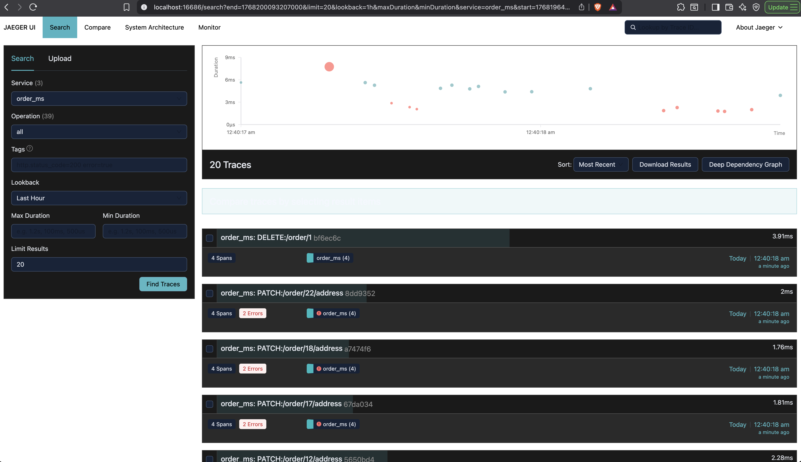
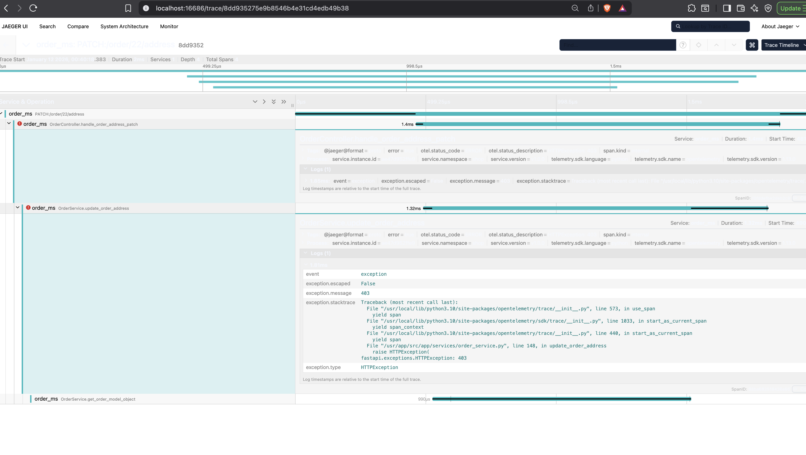
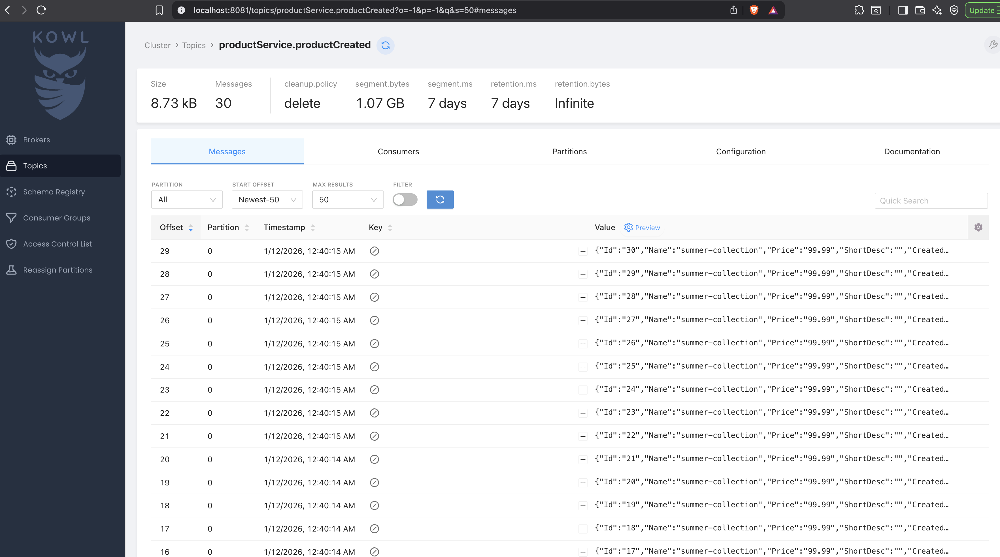
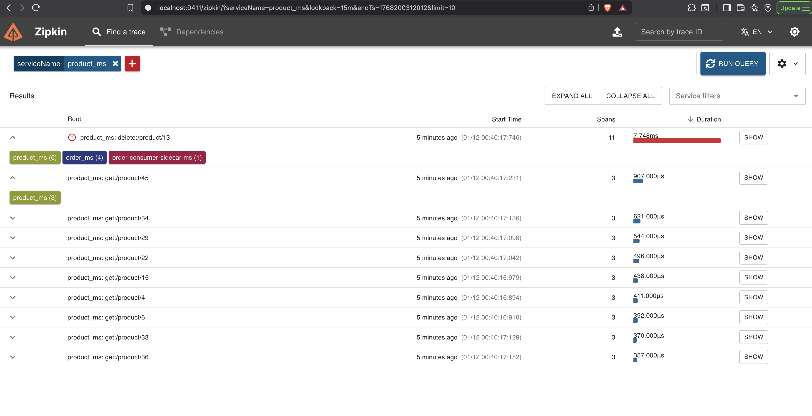
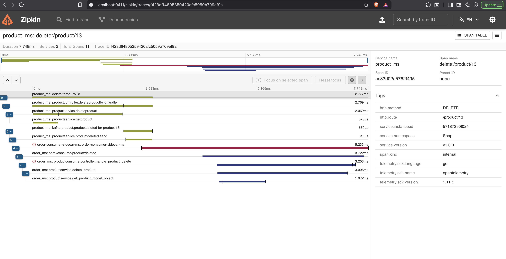

### How to run application !!!
Setup Everything with one script
```bash
# run apps
$ chmod +x run.sh
$ ./run.sh
# create tables in db
$ chmod +x migrations.sh
$ ./migrations.sh run
```

OR 
Run each infrastructure manually 
First run kafka

> docker-compose -f deploy/kafka-compose.yaml up -d

Second run logging containers

> docker-compose -f deploy/logs-compose.yaml up -d

Third run application containers

> docker-compose -f deploy/docker-compose.yaml up

Fourth run migration to create tables in database
```bash
$ chmod +x migrations.sh
$ ./migrations.sh run
```


Running Applications\
[product microservice](./products/README.md) `localhost:8082/products`\
[order microservice](./orders/README.md) `localhost:8083/order/`\
[kafka ui](./deploy/kafka-compose.yaml#L52) `localhost:8081`\
[Zipkin](./deploy/logs-compose.yaml#L30) `localhost:9411`\
[Jaeger](./deploy/logs-compose.yaml#L22) `localhost:16686`\
[consumer node](./consumer-node/README.md)\
[consumer cpp](./consumers/README.md)

[Api Documentation](./api-doc.md)

### Screenshots








## DISTRIBUTED TRACING

In distributed systems, a single operation may traverse across multiple software components. each software components may produce traces/logs that are uniquely identifiable across the participating systems. so it is very difficult to correlate those traces/logs.

In order to correlate those traces/logs, they must share a context that tells them that they are part of a specific transaction/operation.

Trace context is something that can be passed along with the request, that tells the participating system that it is a part of a specific operation.

Trace context is split into two individual propagation fields supporting interoperability and vendor-specific extensibility:

**_traceparent header_** : represents the incoming request in a tracing system in a common format, understood by all vendors.

Format: {version}-{trace_id}-{parent_id}-{trace_flags}

**version** => 2 HEXDIGLC (Hexadecimal digits lowercase)

> The current specification assumes the version is set to 00. Version ff is forbidden

**trace_id** => 32 HEXDIGLC (16 bytes array identifier. All zeroes forbidden)

> All traces belonging to the same transaction will have same trace_id. it is a unique identifier across the distributed system.

[how to generate trace_id ?](https://www.w3.org/TR/trace-context-1/#considerations-for-trace-id-field-generation)

**parent_id** => 16 HEXDIGLC (8 bytes array identifier. All zeroes forbidden)

> It is the id of the caller. In some tracing system it may also be known as the span_id.

**trace_flags** => 2 HEXDIGLC (8 bit flags.)

> The current version of this specification (00) only supports a single flag called sampled.

```
static final byte FLAG_SAMPLED = 1; // 00000001
boolean sampled = (traceFlags & FLAG_SAMPLED) == FLAG_SAMPLED;
```

Ex:

```
00-4bf92f3577b34da6a3ce929d0e0e4736-00f067aa0ba902b7-01
base16(version) = 00
base16(trace-id) = 4bf92f3577b34da6a3ce929d0e0e4736
base16(parent-id) = 00f067aa0ba902b7
base16(trace-flags) = 01  // sampled
```

```
00-4bf92f3577b34da6a3ce929d0e0e4736-00f067aa0ba902b7-00
base16(version) = 00
base16(trace-id) = 4bf92f3577b34da6a3ce929d0e0e4736
base16(parent-id) = 00f067aa0ba902b7
base16(trace-flags) = 00  // not sampled
```

**_tracestate header_** (optional): includes the parent in a potentially vendor-specific format

<a href="https://www.w3.org/TR/trace-context-1/" target="_blank">Read more...</a>


